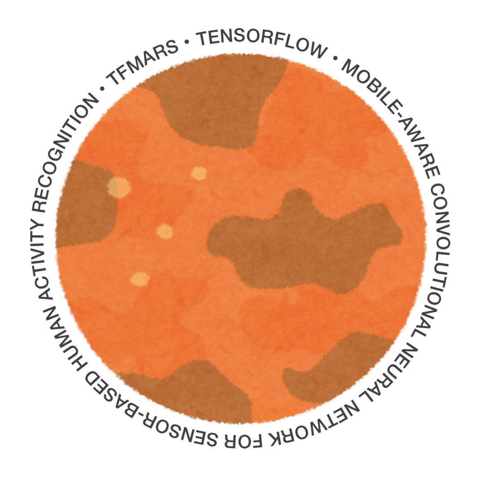

# tfmars

<p align="center">
    
</p>

**tfmars** is the TensorFlow's implementation of Mobile-aware Convolutional Neural Network for Sensor-based Human Activity Recognition, a sibling of [tfgarden](https://github.com/Shakshi3104/tfgarden).
In this repository, some CNN models implemented in tfgarden have been implemented as Attention insertable models. 
Also, **MarNASNets** has been implemented.

MARS means **M**obile-aware **A**ctivity **R**ecognition model**S**.

## Models

- Simple CNN: used on [the paper by Li et al](https://www.mdpi.com/1424-8220/18/2/679).
- VGG16
- Inception v3
- ResNet 18
- PyramidNet 18
- Xception
- DenseNet 121
- MobileNet
- MobileNetV2
- MobileNetV3 Small
- NASNet Mobile
- MnasNet
- EfficientNet B0
- EfficientNet lite0

### MarNASNets

**MarNASNets** are the CNN architectures designed by using Bayesian-optimization Neural Architecture Search via Keras Tuner.
MarNASNets are **mobile-aware** models that achieves higher accuracy with fewer parameters than existing models.
There are variations with different search spaces (A - E).

## Performance

| Model | Accuracy [%] [^1] | Size [MB] [^2] | MFLOPs | Latency [ms] [^3] | CPU load [^3] |
| :------ | :---------: | :-------: | :-----: | :----------: | :-------: |
| Simple CNN         | 87.71    | 5.31   | 9.22    | 4.37  | 1.59      |
| VGG16              | 89.54    | 154.00 | 357.13  | 5.64  | 1.83      |
| Inception-v3       | 91.85    | 57.22  | 287.16  | 3.69  | 1.51      |
| ResNet 18          | 90.53    | 15.41  | 173.72  | 2.67  | 1.50      |
| PyramidNet 18      | 91.48    | 1.63   | 19.49   | **2.12**  | 1.65      |
| Xception           | 92.31    | 82.69  | 613.98  | 4.09  | 2.10      |
| DenseNet 121       | 92.55    | 22.31  | 192.97  | 2.84  | 2.11      |
| MobileNet          | 91.22    | 23.96  | 155.47  | 2.83  | 1.88      |
| MobileNetV2        | 90.62    | 26.91  | 147.96  | 2.96  | 1.61      |
| MobileNetV3 Small  | 91.45    | 11.60  | 35.19   | 2.48  | **1.42**      |
| NASNet Mobile      | 86.49    | 16.55  | 147.23  | 3.23  | 2.65      |
| MnasNet            | 89.75    | 37.44  | 179.77  | 3.12  | 1.66      |
| EfficientNet B0    | 92.50    | 45.70  | 221.68  | 3.32  | 1.59      |
| EfficientNet lite0 | 91.52    | 43.11  | 220.17  | 3.21  | 1.89      |
| MarNASNet-A        | 91.68    | 1.31   | 43.29   | 2.30  | 1.68      |
| MarNASNet-B        | 91.79    | **0.42**   | **4.79**    | 2.21  | 1.47      |
| MarNASNet-C        | **92.60**    | 3.08   | 46.20   | 2.22  | 1.83      |
| MarNASNet-D        | 91.87    | 1.25   | 19.83   | 2.25  | 1.86      |
| MarNASNet-E        | 91.70    | 8.16   | 166.26  | 2.86  | 1.46      |


[^1]: Verifying accuracy with [HASC-PAC2016](http://hub.hasc.jp) (HASC)
[^2]: Size of MLModel file
[^3]: Testing conducted using iPhone 12 mini with iOS 15.2


## Install

```bash
pip install git+https://github.com/Shakshi3104/tfmars.git
```

## Dependency

- `tensorflow >= 2.4.1`

## Citation 

Under construction...
